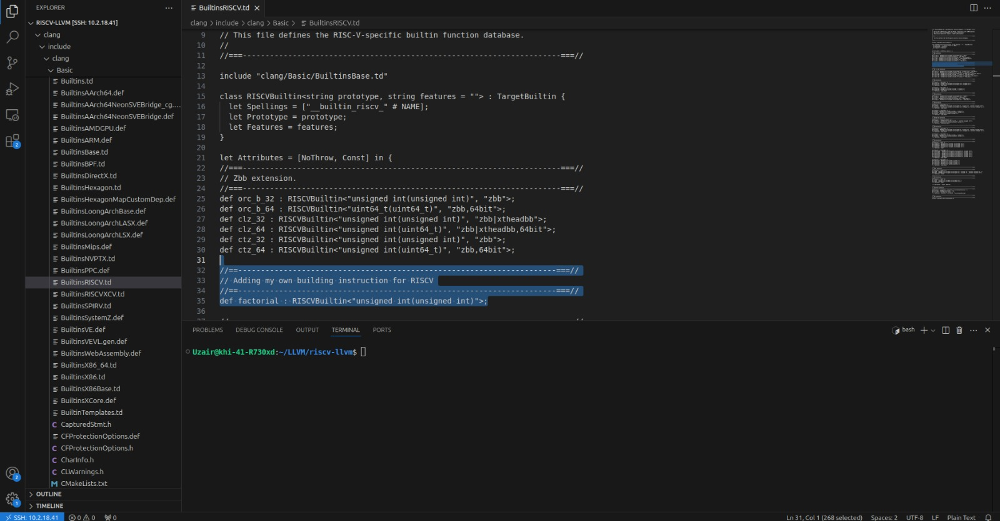
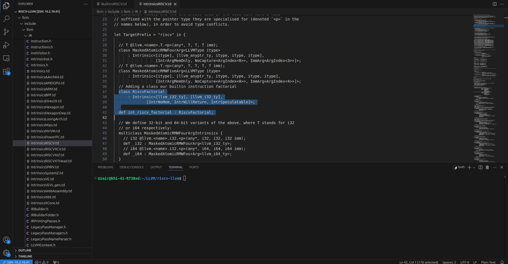
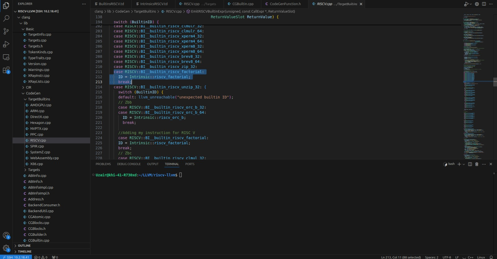
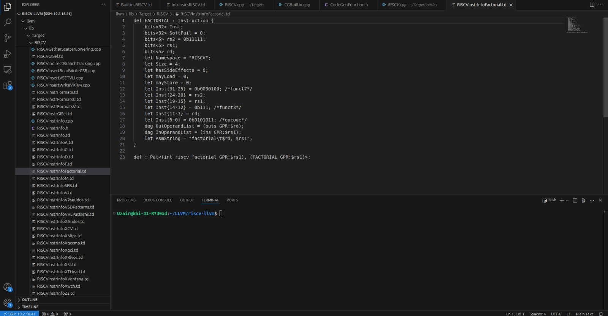
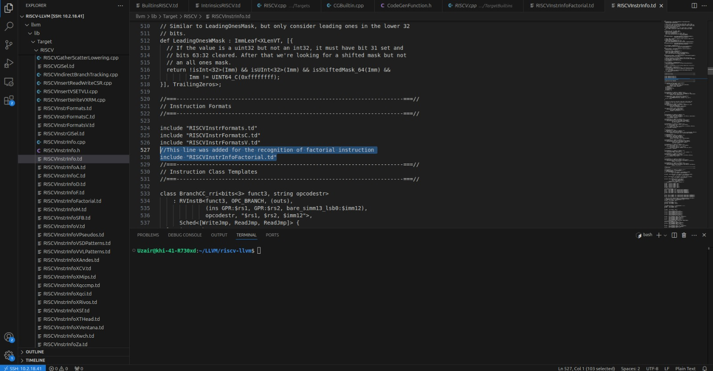
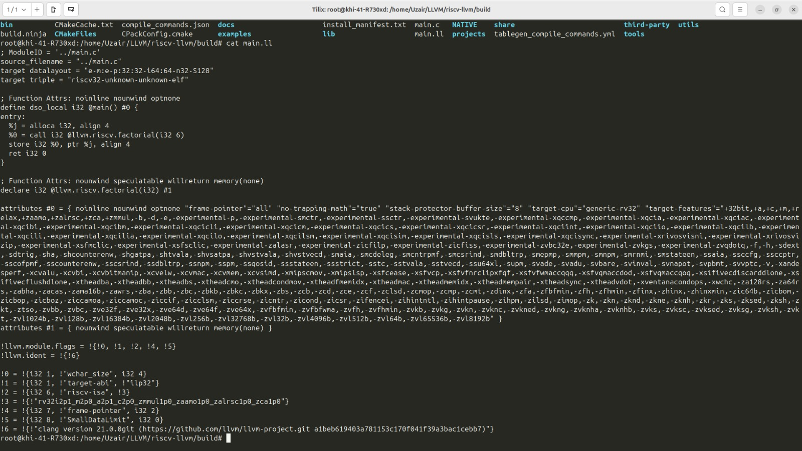

# Tutorial: Adding a Dummy Intrinsic in LLVM for RISC-V

This tutorial shows the easiest way to add a Clang builtin, map it to an LLVM intrinsic in the middle end, and ultimately implement a custom instruction (e.g., `factorial`) in the RISC-V backend.

---

## Before starting let us have a look at the basic 6 steps of a generic compiler and where each step lies


---

## 1. Lexical Analysis (Scanner)

- **Purpose**: Converts raw source code into a stream of **tokens**.
- **Details**: Tokens are the smallest units of meaning (like keywords, identifiers, operators).
- **Common Tool**: `lex`, `flex`.

---

## 2. Syntax Analysis (Parser)

- **Purpose**: Parses the token stream using grammar rules to produce a **parse tree** or **abstract syntax tree (AST)**.
- **Details**: Validates the code structure according to the language's syntax.
- **Common Tool**: `yacc`, `bison`.

---

## 3. Semantic Analysis

- **Purpose**: Checks the AST for semantic correctness (e.g., type checking, scope rules).
- **Details**: Builds a **symbol table**, resolves variable declarations, and ensures meaningful statements.

---

## 4. Intermediate Code Generation

- **Purpose**: Translates the AST into a **platform-independent intermediate representation (IR)**.
- **Details**: Acts as a bridge between high-level and machine-level code.
- **Example**: LLVM IR.

---

## 5. Optimization

- **Purpose**: Enhances performance or reduces the size of the IR.
- **Details**: May involve **dead code elimination**, **constant folding**, **loop unrolling**, etc.
- **Note**: Optimizations can occur at multiple levels.

---

## 6. Code Generation

- **Purpose**: Converts IR into **machine code** for the target architecture.
- **Details**: Resolves registers, instructions, and memory addressing to generate assembly or object files.

---

These steps are foundational in modern compiler architectures such as **LLVM** and **GCC**, and often implemented in modular phases to support flexibility and extensibility.


##  LLVM Architecture Overview

### LLVM Frontend
- The **frontend** (Clang) parses C/C++ and converts it to LLVM Intermediate Representation (IR).
- It defines **builtins** like `__builtin_riscv_factorial`, which are recognized during parsing.

### LLVM Middle-End
- The **middle-end** performs optimizations and translates builtins into **intrinsics**, which are abstract operations represented in IR.

### LLVM Backend
- The **backend** lowers intrinsics to **machine instructions** for a specific architecture—in this case, RISC-V.

---


## Requirements

Before starting:

- Understand LLVM IR and TableGen
- Be comfortable with RISC-V assembly
- Set up a C++ development environment with CMake and Ninja
- Install RISC-V GNU toolchain

---

## Step 1: Download RISC-V Toolchain

Get the 32-bit version of `riscv-gnu-toolchain` from its [GitHub repository](https://github.com/riscv-collab/riscv-gnu-toolchain).

---

### What is the RISC-V GNU Toolchain?

The **RISC-V GNU toolchain** is a set of tools based on the **GNU Compiler Collection (GCC)** that allows developers to compile, assemble, and link code for **RISC-V processors**.

It includes key development tools such as:

- **`gcc`** – the compiler for C/C++ code  
- **`as`** – the assembler  
- **`ld`** – the linker  
- **`gdb`** – the debugger  
- **`objdump`, `readelf`** – tools for inspecting binaries  
- **`newlib` or `glibc`** – minimal C standard libraries for embedded development


##  Step 2: Clone LLVM

```bash
git clone https://github.com/llvm/llvm-project.git riscv-llvm

cd riscv-llvm
mkdir build
cd build
```
---

# STEP 3: Build LLVM

```cmd
cmake -G Ninja -DCMAKE_BUILD_TYPE="Debug" -DBUILD_SHARED_LIBS=True \
 -DLLVM_USE_SPLIT_DWARF=True \
 -DCMAKE_INSTALL_PREFIX="<path_to_riscv_gnu_toolchain>" \
 -DLLVM_OPTIMIZED_TABLEGEN=True \
 -DLLVM_BUILD_TESTS=False \
 -DLLVM_DEFAULT_TARGET_TRIPLE="riscv32-unknown-elf" \
 -DLLVM_TARGETS_TO_BUILD="RISCV" \
 -DLLVM_ENABLE_PROJECTS="clang" ../llvm

cmake --build . --target install
```

# STEP: 4 Add builtin to clang

Open the following line
```cmd
clang/include/clang/Basic/BuiltinsRISCV.td
```

Add the following line to it
```cmd
def factorial : RISCVBuiltin<"unsigned int(unsigned int)">;
```
This defines a C funtion
```C
unsigned int __builtin_riscv_factorial(unsigned int);
```

## Follow the following image:




# Step 5: Define LLVM Intrinsic

Open the following file
```cmd
llvm/include/llvm/IR/IntrinsicsRISCV.td
```
Add:
```cmd
let TargetPrefix = "riscv" in {

  class RiscvFactorial
      : Intrinsic<[llvm_i32_ty], [llvm_i32_ty],
              [IntrNoMem, IntrWillReturn, IntrSpeculatable]>;

  def int_riscv_factorial : RiscvFactorial;
}
```
This defines the IR intrinsic called llvm.riscv.factorial.

## Follow the following image




# STEP 6: Map Builtin to Intrinsic

Open the follwing file:
```cmd
clang/lib/CodeGen/TargetBuiltins/RISCV.cpp
```

In **EmitRISCVBuiltinExpr**, add to the switch:
```cpp
case RISCV::BI__builtin_riscv_factorial:
    ID = Intrinsic::riscv_factorial;
    break;
```
Follow the following image:




# Step 7: Add RISC-V Instruction

Create a file by the same as following in the same directory:
```cmd
touch llvm/lib/Target/RISCV/RISCVInstrInfoFactorial.td
```

Add the following code to it:
```cmd
def FACTORIAL : Instruction {
    bits<32> Inst;
    bits<32> SoftFail = 0;
    bits<5> rs2 = 0b11111;
    bits<5> rs1;
    bits<5> rd;

    let Namespace = "RISCV";
    let Size = 4;
    let hasSideEffects = 0;
    let mayLoad = 0;
    let mayStore = 0;

    let Inst{31-25} = 0b0000100;
    let Inst{24-20} = rs2;
    let Inst{19-15} = rs1;
    let Inst{14-12} = 0b111;
    let Inst{11-7} = rd;
    let Inst{6-0} = 0b0101011;

    dag OutOperandList = (outs GPR:$rd);
    dag InOperandList = (ins GPR:$rs1);

    let AsmString = "factorial\t$rd, $rs1";
}
```
Also add a matching pattern in the same file:
```cmd
def : Pat<(int_riscv_factorial GPR:$rs1), (FACTORIAL GPR:$rs1)>;
```
### Bit by bit explaination of the 32bit - Instruction

| Bit Range | Field    | Value     | Purpose                                                               |
| --------- | -------- | --------- | --------------------------------------------------------------------- |
| 31–25     | `funct7` | `0000100` | Custom 7-bit opcode extension to identify the factorial instruction.  |
| 24–20     | `rs2`    | `11111`   | Source register 2. Set to a fixed unused register (R31) to simplify.  |
| 19–15     | `rs1`    | dynamic   | Source register 1. Contains the input value for factorial.            |
| 14–12     | `funct3` | `111`     | Custom 3-bit field for instruction grouping/classification.           |
| 11–7      | `rd`     | dynamic   | Destination register. Receives the output of the factorial operation. |
| 6–0       | `opcode` | `0101011` | Custom 7-bit opcode to distinguish this instruction from base ones.   |


## Follow the following image




# Step 8: Include New Instruction
Open the following file:
```cmd
llvm/lib/Target/RISCV/RISCVInstrInfo.td
```
Add the following line:
```c
include "RISCVInstrInfoFactorial.td"
```

## Follow the following image




# Step 9 Rebuild LLVM
```cmd
cd build
cmake --build . --target install
```
# Step 10 Test

Change you directory inside **build** to **bin**. Create a **main.c** file and paste:
```C
int main() {
    unsigned int j = __builtin_riscv_factorial(6);
}
```

Compile it and you have done everything right so far you should see you lowered intrinsic.
```cmd
clang -S -emit-llvm main.c -o main.ll
```
# Final Output


